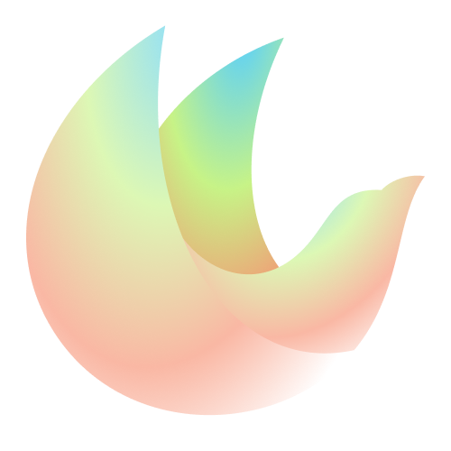

<!-- PROJECT LOGO -->
 

  

  <h1 align="center">Vira Theme</h3>

  

    Original taste, original colors.
  

## Installation and usage

Checkout our discussion board for more info

### [Get started ↗️](https://github.com/vira-theme/vira-theme-support/discussions/1)

## How to customize colors

If you want to customize some colors you can use VSCode Settings to match your taste.

### [Learn how ↗️](https://github.com/vira-theme/vira-theme-support/discussions/2)

